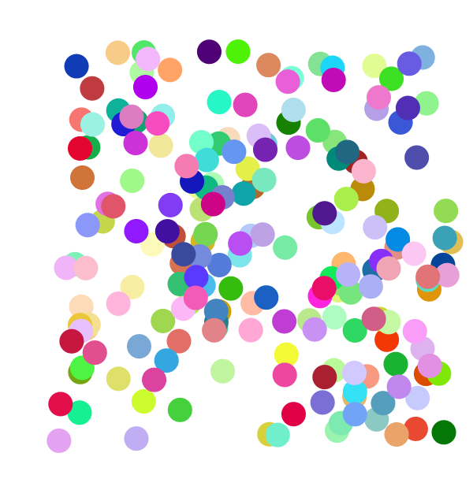
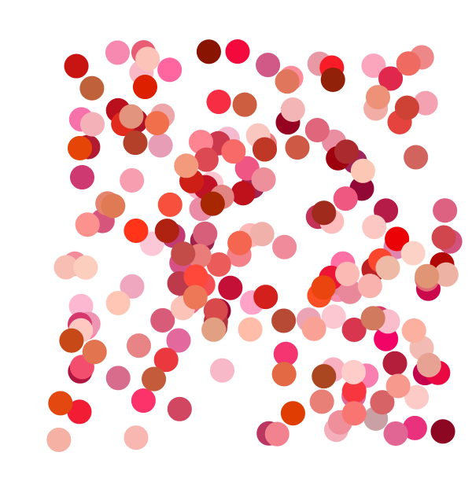
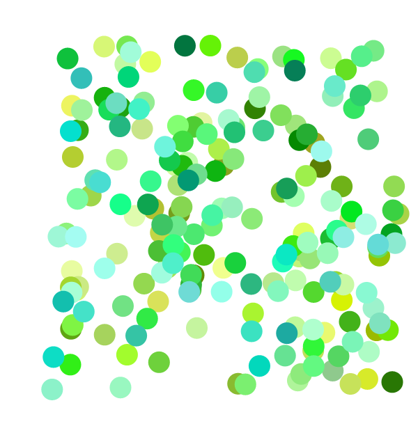
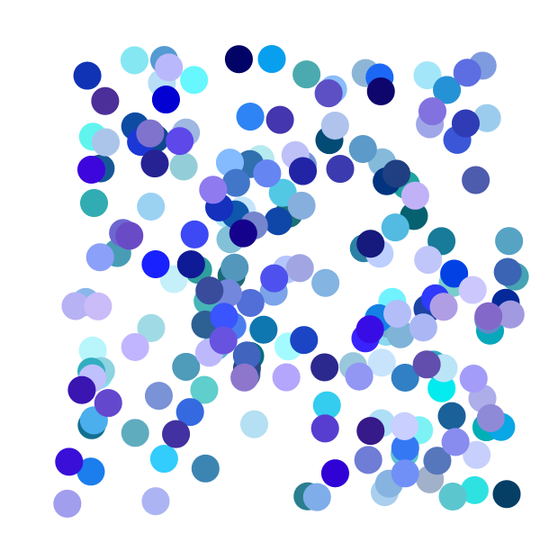
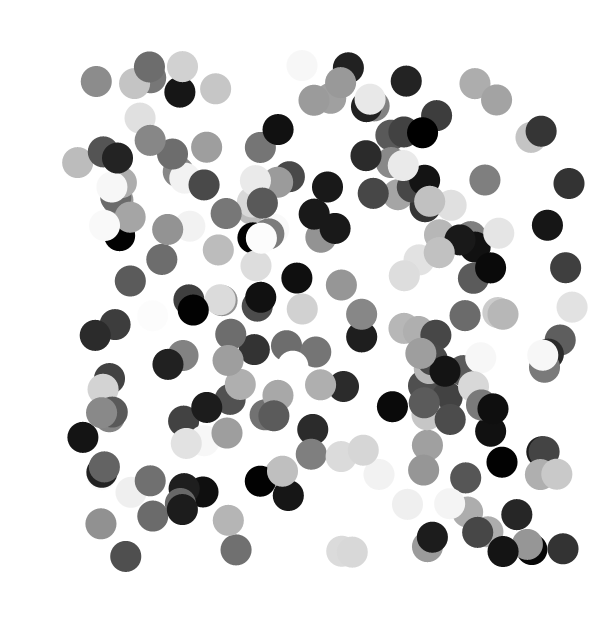
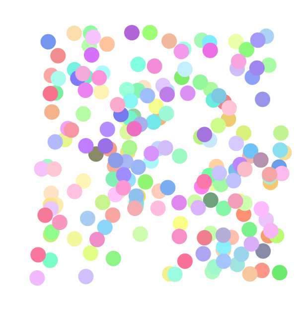
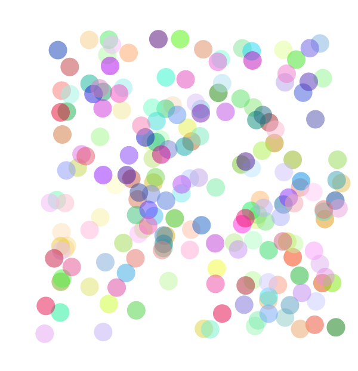

# PrettyRandomColor
Generate pretty color in Mathematica. Ported from [David Merfield's randomColor](https://github.com/davidmerfield/randomColor).

# Installation
1. Open the Mathematica user application folder by `SystemOpen @ FileNameJoin[{$UserBaseDirectory, "Applications"}];`
2. Create a folder called `/PrettyRandomColor` and place `PrettyRandomColor.wl` and `/Kernel` inside.

# Usage
* Load package using ``` << PrettyRandomColor` ```.
* `PrettyRandomColor[]` generate one random color
* `PrettyRandomColor[]` takes the following options:
  * `Hue` restricts the generated color, possible values are: 
    * `Monochrome`, `Red`, `Orange`, `Yellow`, `Green`, `Blue`, `Purple`, `Pink`;
    * String representing hex, e.g., "#ffffff", "#666";
    * Integer (0 ~ 360) representing hue value.
  * `ColorCount` specifies the number of random colors to be generated, default to 1.
  * `Luminosity` a String specifies the luminosity of the color, can be `"Bright"`, `"Light"`, `"Dark"`.
  * `Opacity` a Real (0 ~ 1) specifies the opacity of the color, default to 1.
  * `Seed` an Integer or String representing the RNG seed, default to `None`.
  
## Code example
```
Graphics[
  Riffle[
    PrettyRandomColor[ColorCount -> 200], 
    Disk[#, 1/40] & /@ RandomReal[{.1, .9}, {200, 2}]
  ],
  PlotRange -> {0, 1},
  ImageSize -> 600
]
```


Specifying `Hue` Options:
<p float="left">
   Red" width="250"/>
   
  
</p>

Other examples:
<p float="left">
   Red" width="250"/>
   
  
</p>
